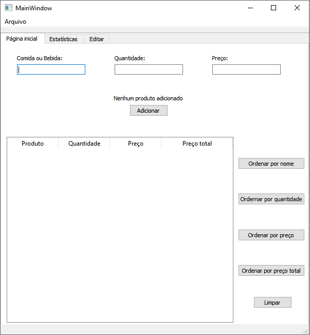
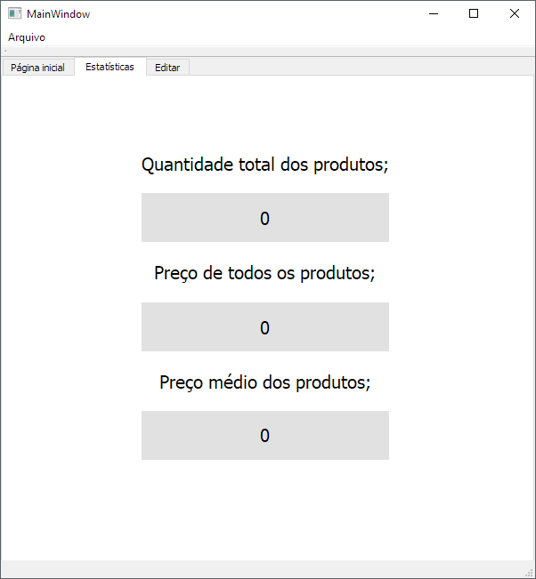
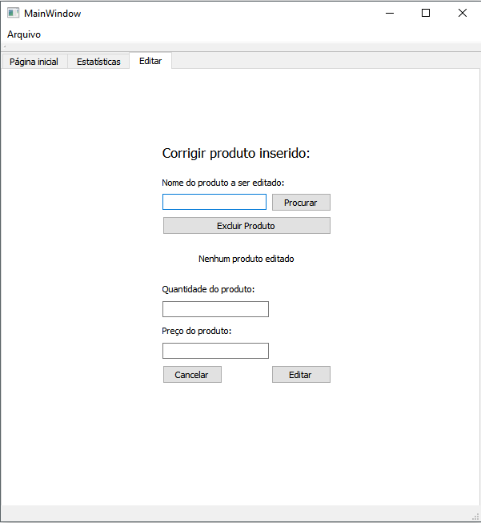
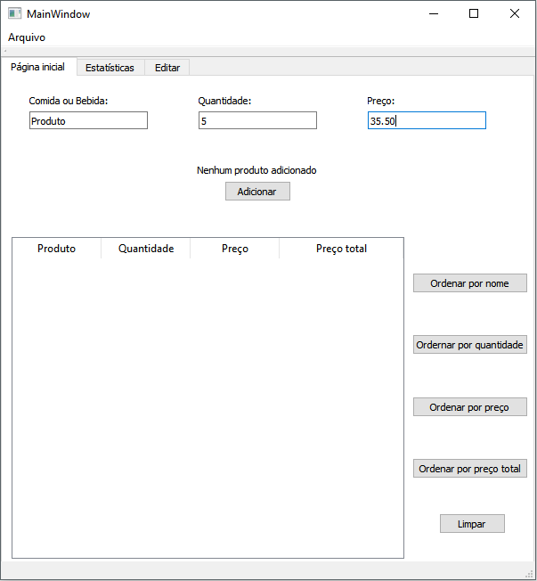
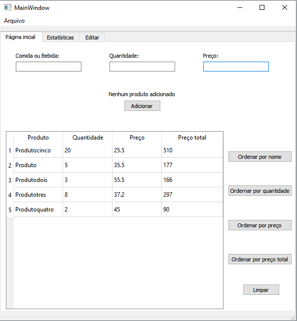
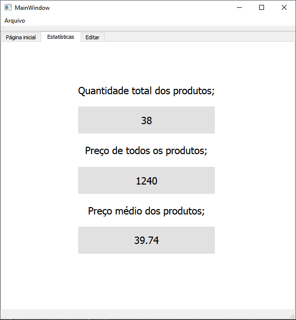
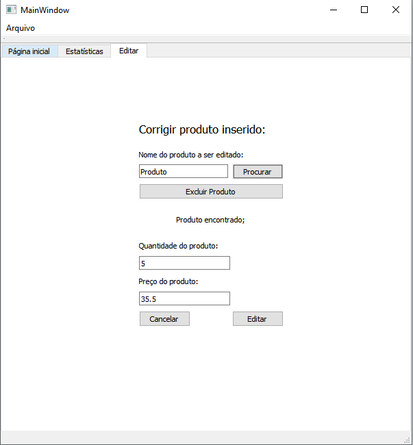
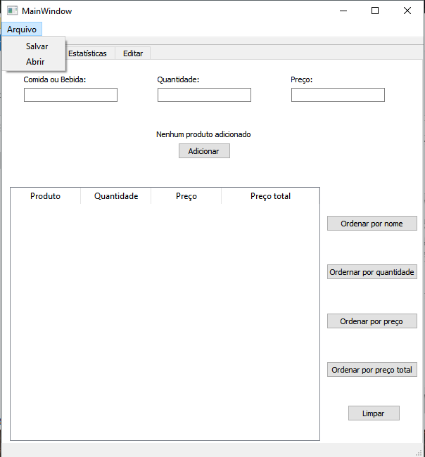

# Daily-Menu
Projeto feito utilizando Qt Creator para a disciplina de Técnicas de Programação 2019.1
-------------

## Projeto Daily Menu.
---------------------
Daily Menu tem como objetivo de criar um cardápio onde se pode adicionar/retirar produtos em um dia de vendas em um bar/restaurante. 
O Cardápio Diário além de criar uma lista com os produtos e suas respectivas quantidades, mostra ao usuário seus valores totais que se espera arrecadar por produto

Mostra a quantidade total de itens o objeto com o maior preço e o menor. 

Permite o usuário editar os itens inseridos na tabela caso haver erros da incrementação dos produtos pelo usuário.

Manual do usuário
--------------------------
A utilização é simples, o usuário acrescenta o nome do produto(aceitando apenas letras), sua quantidade(apenas em números inteiros) e seu valor(recebe valores quebrados com utilização de ponto, ex "25.50"), depois utiliza o botão "Adicionar" para inserir os dados na tabela.Existindo a possiblidade também de organizar os produtos por; Ordem alfabética,quantidade ,preço unitário e preço total. 

Na aba "Estatísticas" podemos observar a quantidade total, preço total e média dos preços dos produtos

Caso aconteça algum erro incrementado nos valores dos produtos, na aba "Editar" pode digitar o nome do produto e depois apertar o botão "Procurar" depois alterar seus valores em "Editar" ou retirar o produto no botão "Excluir";

O progama também permite salvar e carregar um arquivo em Excel, e limpar todos os dados inseridos com o botão "limpar" no canto inferior direito.

